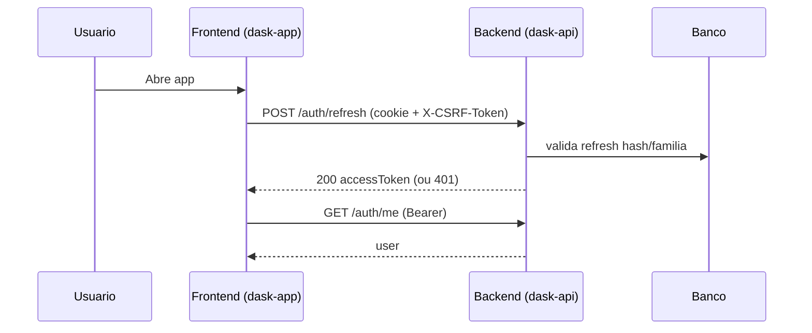

# Fluxo de Autenticação Completo (Estado Atual do Código)

Este documento descreve o fluxo de autenticação fim a fim, conforme implementado hoje no monorepo `E:\Dask` (API + App).

## Escopo

- Backend: `dask-api`
- Frontend: `dask-app`
- Fluxos cobertos:
1. Cadastro
2. Login com senha
3. Login social (Google/Microsoft)
4. Bootstrap de sessão no frontend
5. Refresh de sessão
6. Logout e logout-all
7. Recuperação de senha
8. Verificação de e-mail
9. Proteção de rotas e autorização

## Arquitetura de Sessão

Modelo híbrido:

- `accessToken` (JWT) em memória no frontend
- `refreshToken` em cookie HttpOnly no backend
- CSRF double-submit para rotas mutáveis sensíveis de auth

### Cookies

- Sessão (`refreshToken`): `__Host-session` (prod) ou `dask-session` (dev)
- CSRF: `dask-csrf` (não HttpOnly, lido no frontend para header)

Opções definidas em `dask-api/src/core/http/cookie-config.ts`.

## Endpoints de Auth

Base: `${API_PREFIX}` (padrão `/api/v1`)

- `POST /auth/register`
- `POST /auth/login`
- `GET /auth/google`
- `GET /auth/google/callback`
- `GET /auth/microsoft`
- `GET /auth/microsoft/callback`
- `POST /auth/refresh`
- `POST /auth/logout`
- `POST /auth/logout-all`
- `GET /auth/me`
- `POST /auth/password-reset/request`
- `POST /auth/password-reset/confirm`
- `POST /auth/email-verification/resend`
- `GET /auth/verify-email`

## JWT e Sessão

### Access Token

Emitido pelo backend em login/refresh e contém:

- `sub`: userId
- `email`
- `roles`
- `emailVerified`

Validação no middleware:

- assinatura JWT válida
- expiração válida
- `emailVerified === true`

Se não atender, retorna `401`.

### Refresh Token

- Token opaco aleatório
- Persistido no banco como hash (`sha256`)
- Rotação por família (`familyId`)
- Reuse detection: token revogado reapresentado revoga a família inteira

## Regras Críticas de Verificação de E-mail

### Cadastro (`POST /auth/register`)

- Cria usuário
- Envia e-mail de verificação (assíncrono)
- **Se `emailVerified` for `false`: não emite sessão ativa**
  - Resposta: `user` + `accessToken: null`
  - Cookies de sessão limpos

### Login (`POST /auth/login`)

- Credenciais válidas são necessárias
- Se `emailVerified` for `false`, bloqueia com `403` e `code: EMAIL_NOT_VERIFIED`

### Refresh (`POST /auth/refresh`)

- Exige cookie de sessão + header CSRF válido
- Se usuário da sessão estiver não verificado:
  - revoga tokens ativos do usuário
  - retorna `401` com `code: EMAIL_NOT_VERIFIED`

## CSRF

Aplicado em:

- `POST /auth/refresh`
- `POST /auth/logout`
- `POST /auth/logout-all`

Validação:

1. Se há cookie de sessão, exige `X-CSRF-Token`
2. Token esperado = `HMAC_SHA256(refreshToken, CSRF_SECRET)`
3. Valida `Origin` allowlist e `Sec-Fetch-Site` (defesa adicional)
4. comparação timing-safe

## Login Social (OAuth/OIDC)

Providers:

- Google
- Microsoft

### Início do fluxo

- Gera `state`, `nonce`, `pkceVerifier`
- Salva em cookies HttpOnly de curto prazo
- Redireciona para authorize URL do provider

### Callback

1. Valida `state` por cookie (timing-safe)
2. Troca `code` por tokens com PKCE
3. **Valida assinatura criptográfica do `id_token` via JWKS**:
   - lê header (`kid`, `alg`)
   - baixa JWKS (com cache em memória)
   - resolve chave pública RSA
   - verifica assinatura (`RS256`)
4. Valida claims (`iss`, `aud`, `exp`, `nonce`)
5. Busca perfil do provider
6. Login/link da identidade externa
7. Seta cookies de sessão e redireciona para `/login`

Observação: se já existir conta local com mesmo e-mail sem vínculo social, retorna fluxo de link required (`oauth=link_required`).

## Fluxo no Frontend (dask-app)

## Estado de autenticação

`AuthStore` controla:

- `initializing`
- `authenticated`
- `unauthenticated`
- `refreshing`
- `session_expired`
- `logout_in_progress`

### Bootstrap

Ao iniciar app:

1. tenta `refresh` para obter `accessToken` (via cookie + CSRF)
2. se sucesso, chama `/auth/me`
3. se falha `401`, fica `unauthenticated`

### Requisições HTTP

`apiClient`:

- injeta `Authorization: Bearer` quando há token
- injeta header CSRF em métodos mutáveis
- em `401` de endpoint autenticado, tenta refresh 1 vez e repete request
- evita loop infinito de refresh

Importante:

- sessão é tratada como inválida por `401`
- `403` de autorização/permissão não derruba sessão automaticamente

### Guards de rota

- `ProtectedRoute`: exige autenticação
- `PublicRoute`: redireciona autenticado para entrada do workspace
- estados `initializing/refreshing`: mostra fallback de carregamento

## Recuperação de Senha

### Solicitar reset (`POST /auth/password-reset/request`)

- sempre responde mensagem genérica anti-enumeração
- cria token one-time (hash no banco, expiração 1h)
- envia e-mail quando provedor está configurado

### Confirmar reset (`POST /auth/password-reset/confirm`)

- valida token e política de senha
- marca token como usado
- atualiza senha
- revoga todas as sessões do usuário
- invalida tokens de reset pendentes

## Verificação de E-mail

### Confirmar (`GET /auth/verify-email?token=...`)

- token one-time com hash em banco
- valida não expirado/não usado
- marca usuário como verificado

### Reenviar (`POST /auth/email-verification/resend`)

- resposta genérica (anti-enumeração)
- só envia para conta local pendente

## Proteções de Segurança Implementadas

- Senha com política forte (NIST-alinhada no serviço)
- Hash com pepper + versão de hash + migração transparente
- Lockout progressivo por falha de login
- Token rotation + reuse detection
- CSRF com HMAC e verificação de origem
- CORS com allowlist explícita (sem wildcard)
- Cookies `Secure` em produção
- Headers de segurança com Helmet
- `no-store` em respostas de autenticação

## Códigos de erro relevantes

- `401`:
  - token ausente/inválido/expirado
  - refresh inválido
  - e-mail não verificado em refresh/middleware
- `403`:
  - e-mail não verificado no login (`EMAIL_NOT_VERIFIED`)
  - falha de CSRF
- `409`:
  - conflito de cadastro
  - fluxo social exigindo vínculo prévio
- `429`:
  - lockout/rate-limit

## Configuração necessária (resumo)

Backend (`dask-api`):

- `JWT_SECRET`
- `JWT_REFRESH_EXPIRES_IN`
- `HASH_PEPPER`
- `CSRF_SECRET`
- `CORS_ALLOWED_ORIGINS`
- `COOKIE_SAME_SITE`
- OAuth: `GOOGLE_*` e/ou `MICROSOFT_*`
- E-mail: `RESEND_API_KEY` (opcional, recomendado em prod)

Frontend (`dask-app`):

- `VITE_API_BASE_URL`
- `VITE_API_PREFIX`
- `VITE_CSRF_HEADER_NAME` (padrão `x-csrf-token`)

## Sequência resumida

## Fonte da verdade

Este documento reflete o comportamento implementado no código atual. Em caso de divergência futura, o código é a fonte principal e este documento deve ser atualizado no mesmo PR da mudança de auth.
